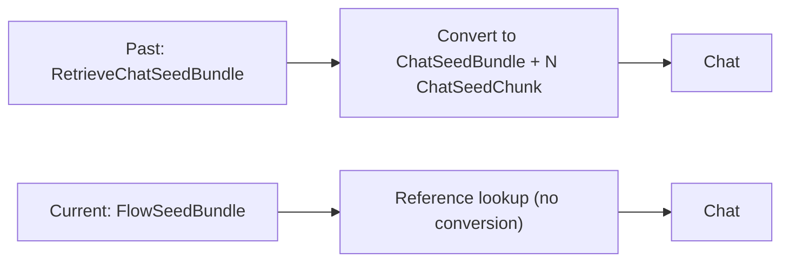

# Flow Conversion Costs (Condensed)

## One-screen summary

- Scope: `retrieve -> chat` handoff in flow runtime.
- Baseline (past): `a6872ab`
- Current branch: `11d216c`
- Main change: removed cross-model seed conversion (`RetrieveChatSeed* -> ChatSeed*`) and now pass one canonical `FlowSeedBundle` by reference.

## Exact cost model (handoff boundary only)

Let `N = number of seeded chunks`:

| Path | Pydantic validations | Model allocations | List-copy allocations |
|---|---:|---:|---:|
| Past (`a6872ab`) | `N + 1` | `N + 1` | `3` |
| Current (`11d216c`) | `0` | `0` | `0` |

## Measured microbench (local, snippet len=320)

| Chunks (`N`) | Past avg / p95 | Past peak alloc | Current avg / p95 | Current peak alloc |
|---:|---:|---:|---:|---:|
| 20 | `145.8us / 167.5us` | `24,382B` | `5.2us / 9.5us` | `24B` |
| 80 | `445.8us / 485.0us` | `89,724B` | `5.9us / 10.1us` | `24B` |
| 160 | `849.8us / 1058.4us` | `176,764B` | `5.5us / 9.4us` | `24B` |

## Remaining hot spots (outside handoff)

- `RetrieveSettings.model_validate(payload)` once per retrieve stage run.
- `ChatSettings.model_validate(payload)` once per chat stage run.

Planned next optimization: compile-once stage config to remove repeat config validation in steady-state flow runs.
