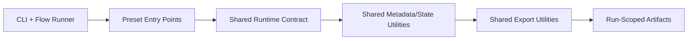
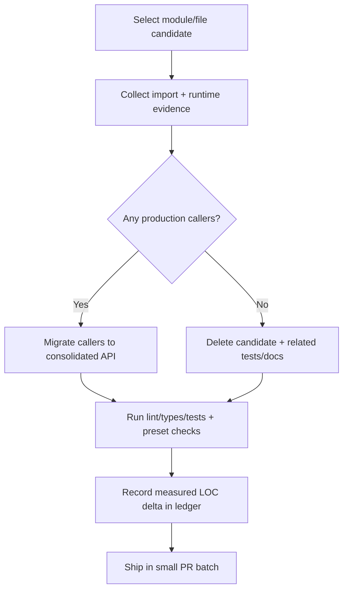

# sec-nlp Roadmap: Consolidation-First (-2,000 LOC Initial Target)

This roadmap focuses on reducing code volume and module sprawl before adding
new capabilities. The first milestone is a measurable net reduction of at least
2,000 lines while preserving behavior in active pipelines and CLI workflows.

## 0) Objective and guardrails

### Primary objective

Deliver **net -2,000 LOC** across `src/sec_nlp/`, `tests/`, and related docs by
consolidating runtime concerns, deleting dead layers, and removing duplication.

### Non-negotiable guardrails

- Preserve runtime behavior for `analyze`, `exb`, and `warranty` presets.
- Preserve active CLI run/output contracts.
- Require import-graph + runtime-call evidence before deleting any module.
- Track every merge/delete in a consolidation ledger with measured LOC deltas.

---

## 1) Evidence snapshot (current code)

Architecture context comes from `docs/ARCHITECTURE.md`, which defines pipeline
preset execution, run-scoped outputs, and shared lifecycle boundaries.

### 1.1 Candidate package size snapshot

| Package | Python files | Approx LOC |
|---|---:|---:|
| `src/sec_nlp/pipelines/metadata/` | 5 | 474 |
| `src/sec_nlp/pipelines/state/` | 3 | 433 |
| `src/sec_nlp/pipelines/async_support/` | 3 | 592 |
| **Subtotal (high-priority consolidation area)** | **11** | **1,499** |

Largest files in these candidates:

- `src/sec_nlp/pipelines/async_support/mixin.py` (~321 LOC)
- `src/sec_nlp/pipelines/state/store.py` (~295 LOC)
- `src/sec_nlp/pipelines/async_support/vector.py` (~241 LOC)
- `src/sec_nlp/pipelines/metadata/exhibit.py` (~199 LOC)

### 1.2 Known downstream callers (initial grep map)

#### Metadata package

- `src/sec_nlp/pipelines/presets/analyze/pipeline.py`
- `src/sec_nlp/pipelines/presets/analyze/run_stages.py`
- `src/sec_nlp/pipelines/presets/analyze/runnables/search.py`
- `src/sec_nlp/pipelines/presets/analyze/runnables/analysis.py`
- `src/sec_nlp/pipelines/presets/analyze/io/outputs.py`
- `src/sec_nlp/pipelines/presets/exb/run_stages.py`
- `src/sec_nlp/pipelines/vector/query.py`
- `src/sec_nlp/pipelines/chunk_filters.py`

#### State package

- `src/sec_nlp/pipelines/presets/analyze/pipeline.py`
- `tests/pipelines/state/test_store.py`
- `tests/pipelines/presets/test_analyze_pipeline.py`

#### Async support package

- Only test import found in `tests/pipelines/async_support/test_mixin.py`
- No production `src/` imports found in initial caller scan

> This evidence supports treating `async_support` as a top candidate for hard
> reduction, subject to runtime verification.

---

## 2) Consolidation target architecture

### Direction

- Collapse fragmented runtime concerns into one explicit runtime package.
- Remove optional layers that are not used in production call paths.
- Keep preset code focused on domain logic instead of utility duplication.

---

## 3) Reduction plan by module family

### 3.1 Runtime consolidation (`metadata` + `state`)

**Source scope**

- `src/sec_nlp/pipelines/metadata/*`
- `src/sec_nlp/pipelines/state/*`

**Target scope**

- `src/sec_nlp/pipelines/runtime/*` (single runtime ownership boundary)

**Actions**

1. Move metadata normalization/filter/accession helpers under runtime namespace.
2. Move processing-state models/store under runtime namespace.
3. Update imports in:
   - `src/sec_nlp/pipelines/presets/analyze/*`
   - `src/sec_nlp/pipelines/presets/exb/run_stages.py`
   - `src/sec_nlp/pipelines/vector/query.py`
   - `src/sec_nlp/pipelines/chunk_filters.py`
4. Delete legacy `metadata/` and `state/` modules after migration.

**Planned LOC effect**: **-500 to -700 LOC** (duplication + dead wrappers + stale tests).

### 3.2 Async support elimination or strict minimization

**Source scope**

- `src/sec_nlp/pipelines/async_support/*`

**Actions**

1. Verify no runtime imports through test + CLI smoke runs.
2. If confirmed unused in production, remove entire package.
3. If one utility is required, keep a single adapter and delete remainder.
4. Remove or rewrite tests that target deleted API surface.

**Planned LOC effect**: **-350 to -550 LOC**.

### 3.3 Export and utility deduplication

**Source scope (initial)**

- Analyze/EXB output and metadata-output helpers under preset IO modules.
- Shared helpers spread across preset packages for naming/path writing.

**Target scope**

- `src/sec_nlp/core/exports/*` for path and serialization conventions.

**Actions**

1. Centralize run-path and artifact-name generation.
2. Centralize CSV/JSON/YAML emit helpers used by multiple presets.
3. Remove preset-local duplicate helpers after callsite migration.
4. Delete stale tests/docs tied to replaced helper paths.

**Planned LOC effect**: **-600 to -900 LOC**.

---

## 4) Net -2,000 LOC ledger target

| Workstream | Planned LOC Δ |
|---|---:|
| Runtime consolidation (`metadata` + `state`) | -600 |
| Async support elimination/minimization | -450 |
| Export helper consolidation | -650 |
| Duplicate preset utility cleanup | -300 |
| Stale tests/docs cleanup | -200 |
| **Total planned** | **-2,200** |

A -2,200 plan is intentional to preserve buffer for unavoidable replacement code
and still land at or below **-2,000 net**.

---

## 5) Deletion/merge workflow (required per candidate)

### Gate checklist

- Evidence captured (imports and runtime use).
- Replacement path documented (if callers existed).
- `analyze`, `exb`, `warranty` verification completed.
- LOC ledger updated with before/after measurements.

---

## 6) Phase plan (execution order)

### Phase A (Week 1): evidence hardening

- Build baseline LOC report by package and file.
- Build caller map for metadata/state/async_support modules.
- Produce top 10 candidate deletion/merge list by LOC impact.

**Exit criterion**: projected reduction at least **-1,400 LOC**.

### Phase B (Weeks 2–3): runtime boundary merge

- Migrate metadata + state APIs into runtime package.
- Rewrite callsites in analyze/exb/vector/chunk modules.
- Remove obsolete module files and stale tests.

**Exit criterion**: realized reduction at least **-700 LOC**.

### Phase C (Weeks 3–4): async + export dedupe

- Delete or reduce async_support package.
- Consolidate export helper stack and remove duplicates.
- Update tests to target shared utility paths.

**Exit criterion**: cumulative realized reduction at least **-2,000 LOC**.

### Phase D (Week 5): stabilization and sign-off

- Run full validation checks and output comparison.
- Publish before/after module map and measured LOC ledger.
- Freeze for one cycle before any major feature expansion.

---

## 7) Verification matrix (minimum)

- `analyze`: run representative symbol set and compare output structure.
- `exb`: run extraction path and verify exhibit result artifacts.
- `warranty`: run deterministic extraction and verify summary parity.
- CLI: verify run creation, output folder naming, and registry behavior.

---

## 8) Deferred until after initial reduction goal

- New Rust crates unrelated to consolidation.
- New display/UI package expansion beyond deduping existing output paths.
- Broad feature additions that increase code surface before cleanup lands.

This roadmap intentionally optimizes for reduction-first delivery so the next
feature cycle starts from a smaller, clearer, and cheaper-to-maintain codebase.
