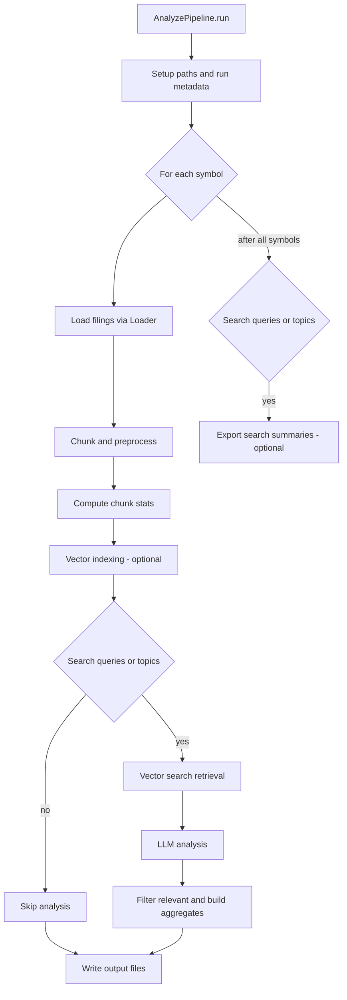

# Analyze Pipeline

The analyze pipeline performs semantic search and LLM-driven analysis over SEC filings. It loads filings, splits and filters content, indexes embeddings when enabled, retrieves search hits, analyzes only those hits with the LLM, and writes aggregated outputs plus optional search summaries.

## Visual Flow



Implementation layout:
- `runnables/` contains the execution units (analysis, search, EFTS, market correlation).
- `steps/` groups pipeline stages (preprocess, indexing, search, analysis).
- `io/` holds output formatting/export helpers.

## How to run

Prereqs:
- Set `SEC_NLP_ANALYZE_EMAIL` (required by SEC EDGAR).
- Env prefix: `SEC_NLP_ANALYZE_`.
- Start Ollama and pull the LLM/embedding models you plan to use.

Examples:
```
sec-nlp analyze
sec-nlp analyze AAPL --preset quick
sec-nlp analyze AAPL --preset deep
sec-nlp analyze AAPL --topics warranty --topics recall
sec-nlp analyze AAPL --section-type item --section-numbers 1A
sec-nlp analyze AAPL --search.queries "supply chain disruption"
```

Run `sec-nlp analyze --help` for full options.

By default, analyze emits a compact signal-pack result set (relevance, confidence, sentiment/impact, excerpts, and query-match terms). Use `--preset deep` for full-field extraction output.
For a stable one-click production profile, use `--preset sentiment`.

Production baseline example:
```
sec-nlp analyze MP LAC UUUU --preset sentiment
```

Search runs automatically when `--search.queries` is provided. If it is omitted, the pipeline falls back to `--topics` as search queries.

Search summaries are exported after all symbols when `search.export_results` is enabled; the export reuses cached search results from the analysis pass when available.

## Major Steps

### 1) Build components
The pipeline constructs all required components from config in `_build_components`.
- Loader with filing download settings and keyword filtering.
- Optional section filter + extractor for targeted sections.
- Prompt template and analysis instructions based on `analysis_fields`.
- LLM graph runnable and tracing callbacks.
- Vector store (Qdrant) initialization and collection checks.
- Preprocessor, vector indexer, search runner, analysis runner, and output formatter.

Code: `src/sec_nlp/pipelines/presets/analyze/pipeline.py`

### 2) Run setup and symbol loop
`run()` creates output directories, logs run metadata, then processes each symbol sequentially with a progress bar. Per-symbol outputs and stats are collected into the run metadata.

Code: `src/sec_nlp/pipelines/presets/analyze/pipeline.py`

### 3) Load filings
For each symbol, filings are loaded via `Loader.load_documents`, applying the configured filing mode, date range, limits, and optional section filter.

Code: `src/sec_nlp/pipelines/presets/analyze/pipeline.py`

### 4) Chunk and preprocess
Documents are split into chunks and filtered. Preprocessing handles:
- Section-based extraction or sentence splitting.
- Length filters and empty/oversized chunk drops.
- Topic scoring and prioritization.
- SimHash-based deduplication.
- Per-filing caps and top-K selection.

Code: `src/sec_nlp/pipelines/presets/analyze/steps/preprocess/preprocess.py`

### 5) Compute chunk stats
Chunk length stats are computed and logged per accession. These feed into run metadata and diagnostics.

Code: `src/sec_nlp/pipelines/presets/analyze/pipeline.py`

### 6) Vector indexing (optional)
Chunks are indexed into Qdrant when `vector_mode` is `read` or `write`. The indexer applies SimHash deduplication to avoid re-adding similar chunks.

Code: `src/sec_nlp/pipelines/presets/analyze/steps/indexing/vector_index.py`

### 7) Vector search retrieval
If search queries (or topics when queries are empty) are configured, the pipeline retrieves candidate chunks by similarity search and applies the score threshold. Search hits are de-duplicated by content/section/symbol and annotated with `matched_queries` (query + score). Per-query results are cached for the optional summary export after the symbol loop.

Code: `src/sec_nlp/pipelines/presets/analyze/runnables/search.py`

### 8) LLM analysis
Only retrieved search hits are analyzed. The analyzer builds `AnalysisInput` items with matched query hints, context (section + topic hits), and analysis instructions, runs batched LLM calls with retries and fallback, and formats structured result dicts.

Code: `src/sec_nlp/pipelines/presets/analyze/runnables/analysis.py`

### 9) Filter relevant results + write outputs
Results are filtered by relevance and confidence threshold via `OutputFormatter`. Aggregates and diagnostics are computed and exported in the configured formats (YAML/JSON/CSV).

Code: `src/sec_nlp/pipelines/presets/analyze/io/outputs.py`, `src/sec_nlp/pipelines/presets/analyze/io/result_writer.py`

### 10) Export search results (optional)
After all symbols are processed, search results can be exported to consolidated YAML summaries with per-query sections and unique hits. The export reuses cached search results from the analysis pass when available and does not run LLM analysis.

Code: `src/sec_nlp/pipelines/presets/analyze/runnables/search.py`

### 11) Market correlation (optional)
If enabled, the pipeline computes market correlation metrics for relevant results and attaches them to the analysis output.

Code: `src/sec_nlp/pipelines/presets/analyze/runnables/market_correlation.py`

## Output Files

- Analysis outputs are written under:
  `<out_path>/<run_timestamp>/<pipeline_type>/<SYMBOL>/<accession>/analysis.{yaml,csv,json}`
- Search exports are written under:
  `<out_path>/<run_timestamp>/<pipeline_type>/<SYMBOL>/search/summary.yaml`

Paths are created by `AnalyzeConfig.get_symbol_output_dir` and `OutputFormatter.export`.

See also:
- `OUTPUTS_ANALYZE.md`
- `OUTPUTS_SEARCH_SUMMARY.md`

## Key Config Gates

- `search.queries` (or `topics` when queries are empty) must be set to retrieve hits and run analysis.
- `vector_mode` must be `read` or `write` if search is enabled.
- `search.analyze_limit` caps the number of hits analyzed per query (search export can still include the full retrieved set).
- `search.export_results` controls whether search summaries are written after the run.
- `confidence_threshold` controls what is considered relevant in outputs.
- `analysis_fields` controls which fields are requested from the LLM prompt.
- `analysis_instruction_style=compact` reduces prompt token overhead for faster, sentiment-focused runs.
